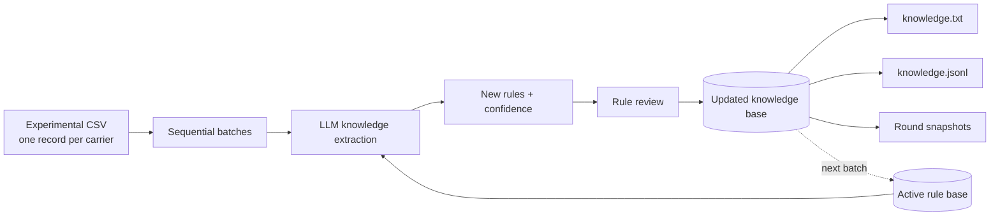

<div align="center">

# PolyACE

### A Polymer Coscientist

*An LLM-assisted framework for accumulating, revising, and preserving design knowledge from sequential polymer mRNA-carrier experiments.*

[](LICENSE)
[](Coscientist/requirements.txt)
[](Coscientist/tests)
[](Coscientist)

</div>

---


Code and data supporting the results in the manuscript will be released here.
**Pretraining codes and fine-tuning scripts** can be found at [PolyTAO](https://github.com/hkqiu/PolymerGenerationPretrainedModel).

## Overview

Scientific agents are beginning to reshape materials discovery, but in experimental chemical and materials systems they typically operate as correlation-driven optimizers and rarely generate explicit, reusable scientific knowledge. **Polymer Coscientist** is a self-evolving agentic framework that generates, evaluates, and learns from polymeric mRNA carriers through closed-loop experimental cycles.

The agent couples three decoupled components:

- **PolyTAO generator** — a fine-tuned generative model that proposes experimentally executable polymer candidates within a modular side-chain chemical space (epoxide / acrylate / dioxaphospholane oxide modules on a poly(L-lysine) backbone).
- **Performance-aware gating core** — a LightGBM-based probabilistic classifier that ranks generated candidates by their likelihood of high transfection performance.
- **Agent memory & reasoning layer** — a knowledge-accumulating reasoning module that reflects on experimental outcomes, extracts and revises design rules, and guides candidate prioritization across feedback cycles.

Across 50 rounds of self-evolution on 1,126 experimentally characterized polymer carriers, the agent accumulated 110 reusable design rules, including non-obvious structure–property relationships. In prospective discovery, the agent explored a validation space of ~50,000 candidate polymers and identified carriers with intramuscular mRNA transfection comparable to clinical-grade lipid nanoparticles (LNPs), achieving an ~20-fold enrichment in high-performance hit rate over empirical screening.

## Key results

- **Model-readable polymer action space**: 1,126 PLL-based polymer carriers synthesized and evaluated via automated liquid-handling within 3 days, providing ratio-resolved structure–transfection training data.
- **Decoupled learning architecture**: independent training of the PolyTAO generator, LightGBM gating model (AUC 0.96 for the high-transfection tier), and the agent's evolving knowledge memory.
- **Self-evolving knowledge**: 110 chronological design rules (64 high-confidence, 18 explicit revisions), with agent discrimination accuracy improving from 0.60 to 0.93 over 50 feedback rounds.
- **System-level enrichment**: integrating generation + gating + agent memory increased executable high-performance hits ~5.9-fold over generation alone (74.3 vs. 12.7 average hits per top-100 trial).
- **Prospective validation**: 10 of 15 agent-generated candidates exceeded the LipoMAX benchmark in vitro (66.7% hit rate vs. ~3.3% for empirical screening); in vivo intramuscular transfection matched SM102-LNP, with an unexpected spleen-biased biodistribution profile after intravenous administration.

## Contents

- [Code availability](#code-availability)
- [Agent workflow](#agent-workflow)
- [Repository layout](#repository-layout)
- [Installation](#installation)
- [Minimal reproducible run](#minimal-reproducible-run)
- [Input contract](#input-contract)
- [Outputs and provenance](#outputs-and-provenance)
- [LLM operation](#llm-operation)
- [Validation](#validation)
- [Research workflow notes](#research-workflow-notes)
- [License](#license)

---

## Code availability

PolyACE provides a transparent, reproducible workflow for transforming sequential batches of tabular experimental records into an evolving and inspectable rule base. The implementation is designed for continual, experiment-grounded knowledge extraction and supports both fully offline validation and integration with an OpenAI Chat Completions-compatible LLM service.

| Capability | Delivered workflow |
| --- | --- |
| **Batch-wise data ingestion** | Reads user-supplied experimental CSV files while preserving the original rows, column names, and values. |
| **Sequential knowledge iteration** | Splits records into ordered batches and carries the active rule base forward from round to round. |
| **LLM rule distillation** | Extracts proposed design rules and calibrated confidence values from each batch in the context of prior knowledge. |
| **Rule lifecycle management** | Reviews new and existing rules, records supersession decisions, and maintains the active rule set. |
| **Versioned knowledge outputs** | Writes human-readable rules, structured JSONL records, and per-round snapshots for review and provenance. |
| **Reproducible execution** | Includes a deterministic local mock client for offline runs, tests, demonstrations, and workflow validation. |

The runnable implementation is in [`Coscientist/`](Coscientist/). The repository root also includes [`src/tsne3d_interactive_en_offline.html`](src/tsne3d_interactive_en_offline.html), a standalone offline 3D t-SNE visualisation.

---

## Agent workflow



For every batch, the workflow serialises the original table rows together with the active rules into LLM prompts. The extraction step proposes new rules and confidence values; the review step records any superseded rules. The updated knowledge base then becomes the context for the following batch, creating a chronological, editable record of knowledge accumulation.

---

## Repository layout

```text
Coscientist/
├── cli.py                         # Command-line entry point
├── configs/config.yaml            # Training and LLM configuration
├── data/raw/                      # Experimental CSV input location
├── coscientist/
│   ├── data/loader.py             # CSV loading and sequential splitting
│   ├── knowledge/distiller.py     # Rule extraction and lifecycle review
│   ├── knowledge/store.py         # Text/JSONL persistence and rule state
│   └── llm/                       # Mock and OpenAI-compatible LLM clients
├── scripts/train_knowledge.py     # Training entry point
└── tests/                         # Offline unit tests
```

---

## Installation

```bash
cd Coscientist
python -m pip install -r requirements.txt
```

The default configuration selects the local mock client, enabling an offline and reproducible execution environment.

---

## Minimal reproducible run

The default configuration reads the English-header carrier dataset from [`Coscientist/data/raw/carrier_dataset.csv`](Coscientist/data/raw/carrier_dataset.csv). It is configured through `training.data_csv: data/raw/carrier_dataset.csv`, relative to `Coscientist/`. The current local dataset contains 1,126 experimental records and nine fields.

Run one knowledge-iteration round with the local mock client:

```bash
cd Coscientist
python cli.py run-training --dry-run --max-rounds 1
```

The mock client returns deterministic, schema-valid placeholder rules. This run exercises the complete data-to-prompt, rule-storage, snapshot, and resume workflow.

<details>
<summary>Additional execution options</summary>

```bash
# Run the configured sequence of rounds with the offline mock client.
python cli.py run-training --dry-run

# Continue from an existing text knowledge base.
python cli.py run-training --dry-run --resume

# Equivalent script-level entry point.
python scripts/train_knowledge.py --config configs/config.yaml --dry-run
```

With the default configuration (`round_size: 20`, `n_rounds: 50`), the first 49 rounds use 20 records each and the final round receives the remaining records. The current dataset therefore supports the complete 50-round workflow.

</details>

---

## Input contract

`CarrierDatasetLoader` reads CSV rows as provided and serialises every row as text for the LLM. The loader preserves the source rows, English headers, and cell values throughout the knowledge-iteration workflow. Missing components and equivalents remain the literal string `NAN`.

<details>
<summary>Default <code>carrier_dataset.csv</code> field reference</summary>

| Header | Role |
| --- | --- |
| `epoxide_component_id` | Epoxide component identifier |
| `dioxaphospholane_oxide_component_id` | Dioxaphospholane oxide component identifier |
| `acrylate_component_id` | Acrylate component identifier |
| `pll_backbone_equivalent` | PLL-backbone equivalent |
| `epoxide_equivalent` | Epoxide component equivalent |
| `dioxaphospholane_oxide_equivalent` | Dioxaphospholane oxide component equivalent |
| `acrylate_equivalent` | Acrylate component equivalent |
| `transfection_efficiency` | Raw transfection readout (RLU) |
| `class_label` | Three-class label (`0`, `1`, or `2`) |

</details>

---

## Outputs and provenance

By default, the workflow writes the following artefacts under `Coscientist/knowledge/`:

```text
knowledge.txt                 # Active rules for direct review and resume
knowledge.jsonl               # Rule IDs, content, confidence, creation round, and status
checkpoints/round_XX.txt      # Active-rule snapshot after each completed round
```

`knowledge.txt` contains active rules in a concise, line-oriented review format:

```text
- [<rule_id>] <rule text> (<confidence label>: <value>)
```

`knowledge.jsonl` provides the full structured history, including `active` and `superseded` rule states. A resumed run reloads the text rule base and continues rule-ID assignment from the highest existing numeric identifier.

---

## LLM operation

**Offline mock mode.** `llm.mock: true` is the default. `MockLLMClient` produces deterministic, schema-valid responses locally, enabling repeatable workflow validation, demonstrations, and tests.

**External LLM mode.** The package includes an OpenAI Chat Completions-compatible client. Set `llm.mock: false`, configure `llm.base_url`, and export the API-key variable named by `llm.api_key_env` (default: `COSCIENTIST_LLM_API_KEY`):

```powershell
$env:COSCIENTIST_LLM_API_KEY = "<your-api-key>"
```

During an external LLM run, the client sends the current batch's experimental records and active rules to `{base_url}/chat/completions`. This makes the service configuration and data-governance decision explicit within the reproducible workflow.

---

## Validation

Run the offline test suite from `Coscientist/`:

```bash
python -m pytest -q
```

The tests exercise sequential splitting, rule-base read/write behaviour, rule states, iterative extraction, and mock-client routing. The suite runs locally with the included mock client.

---

## Research workflow notes

Each persisted rule carries a stable identifier, text content, confidence value, creation round, and lifecycle status. Together with the round snapshots, these records support direct inspection, expert review, comparison across iterations, and reproducible continuation of a knowledge-accumulation run.

---

## License

Released under the [Apache License 2.0](LICENSE).

